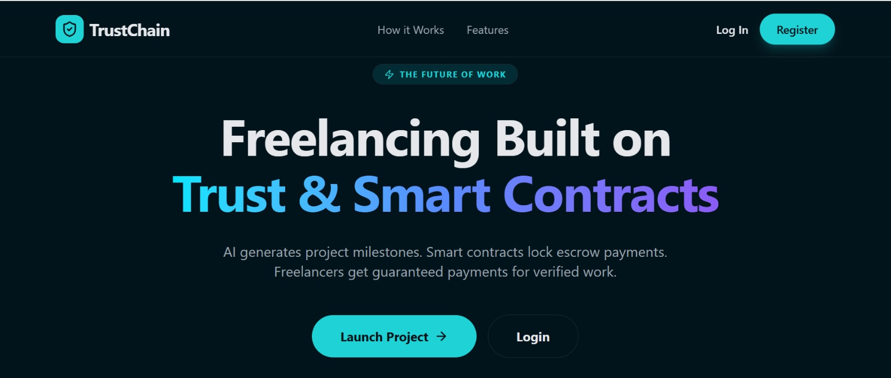

# TrustChain

[](https://drive.google.com/file/d/1DWH3o1ijgf2DxcN0SYxhUrfaQWguup25/view?usp=sharing)
## Click on the Thumbnail for project Demo🎥

---

*TrustChain* is a blockchain-powered platform designed to protect freelancers from delayed or unpaid work while helping them build a *verifiable financial reputation*.

Freelancers frequently face two major problems:

1. Clients delaying or refusing payments
2. Lack of financial credibility because gig income is not recognized by traditional financial systems

TrustChain addresses these challenges using *escrow-based smart contracts* and a *reputation-driven credit scoring system*.

Client payments are *locked before work begins* and automatically released when milestones are approved. At the same time, freelancers build an *on-chain work history* that contributes to a *TrustChain Credit Score*.

---

# Problem Statement

Millions of freelancers and gig workers face:

* Delayed payments
* Non-payment after completing work
* Lack of verifiable financial history
* Difficulty accessing loans or financial services

Traditional financial systems often fail to recognize freelance work or blockchain-based payments, leaving freelancers *financially invisible*.

TrustChain introduces a *secure, transparent, and reputation-based ecosystem* where work history and payments become *verifiable financial signals*.

---

# Solution

TrustChain provides a decentralized trust layer for freelance work through:

## 1. Smart Contract Escrow

Payments are securely locked in a smart contract before work begins, ensuring funds are available and protected.

## 2. Milestone-Based Contracts

Projects are divided into milestones to ensure structured progress tracking and fair payment release.

## 3. Reputation & Credit Score

Freelancers build a *TrustChain Credit Score* based on:

* Completed contracts
* Milestone approvals
* Payment reliability
* Client feedback

This score becomes a *trust signal* for future clients and potential financial services.

---

# Key Features (MVP)

* User authentication (Freelancer / Client)
* Project contract creation
* Milestone-based workflow
* Escrow-style payment locking
* Milestone approval system
* Automatic payment release
* Freelancer credit score generation
* Reputation profile dashboard

---

# User Workflow

### 1. Create Contract

Client creates a project contract and defines milestones.

### 2. Lock Payment

Client deposits the total payment into escrow.

### 3. Work Submission

Freelancer completes a milestone and submits the work.

### 4. Milestone Approval

Client reviews and approves the submitted milestone.

### 5. Payment Release

Smart contract automatically releases the milestone payment.

### 6. Credit Score Update

Freelancer's *TrustChain score* updates based on successful completion.

---

# Tech Stack

## Frontend

* React / React Native
* TypeScript
* Tailwind CSS / Styled Components

## Backend

* Node.js
* Express.js

## Database

* PostgreSQL / Firebase

## Blockchain Layer

* Smart Contracts
* Testnet (Polygon / Ethereum / Solana depending on implementation)

## Tools

* GitHub
* REST APIs
* Cloud Hosting (Vercel / Render / Firebase)

---

# System Architecture

```
Frontend (Web / Mobile)
│
▼
Backend API (Node.js)
│
├── User Authentication
├── Contract Management
├── Milestone Handling
├── Credit Score Service
│
▼
Database
│
├── Users
├── Contracts
├── Milestones
├── Transactions
└── Reputation Scores
│
▼
Smart Contract Layer
(Escrow Payment Logic)

```
---

# Repository Structure

```
trustchain/
│
├── frontend/
│   ├── components/
│   ├── screens/
│   ├── services/
│   └── styles/
│
├── backend/
│   ├── controllers/
│   ├── routes/
│   ├── services/
│   └── models/
│
├── smart-contracts/
│
├── docs/
│   ├── PRD.md
│   ├── TRD.md
│   └── UX.md
│
└── README.md

```
---

# Edge Cases Considered

The system is designed to handle potential real-world scenarios:

* Client rejects milestone
* Client disappears after locking funds
* Freelancer abandons the project
* Disputes between freelancer and client
* Partial milestone completion
* Payment transaction failures

---

# Future Improvements

* Decentralized dispute resolution
* AI-powered credit scoring
* Integration with DeFi lending platforms
* Multi-chain wallet support
* DAO-based arbitration
* Freelancer portfolio verification

---

# Success Metrics

To measure platform effectiveness:

* Number of successful contracts completed
* Payment release success rate
* Growth in freelancer reputation scores
* Reduction in payment disputes
* User adoption and retention rate

---

# Team

Built during a *hackathon project* exploring how *blockchain-based trust systems can empower the global freelance economy.*

---

# Vision

TrustChain aims to become a *financial trust layer for the gig economy*, enabling freelancers worldwide to:

* Build verifiable financial reputations
* Secure fair payments for their work
* Gain access to financial services previously unavailable to them

By combining *smart contracts, reputation systems, and decentralized finance, TrustChain seeks to create a **more trustworthy and equitable freelance ecosystem.*
